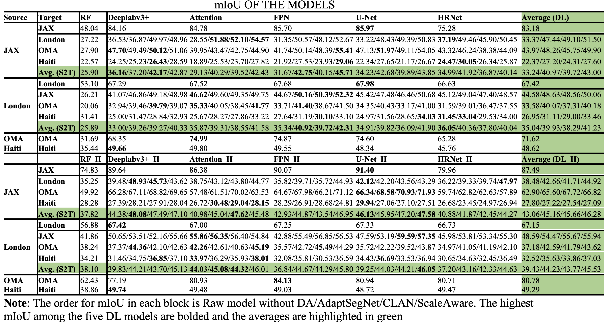
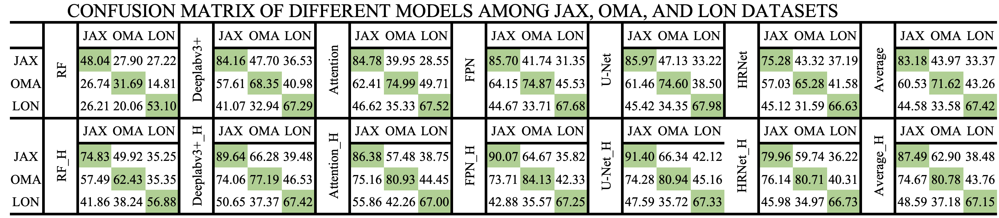
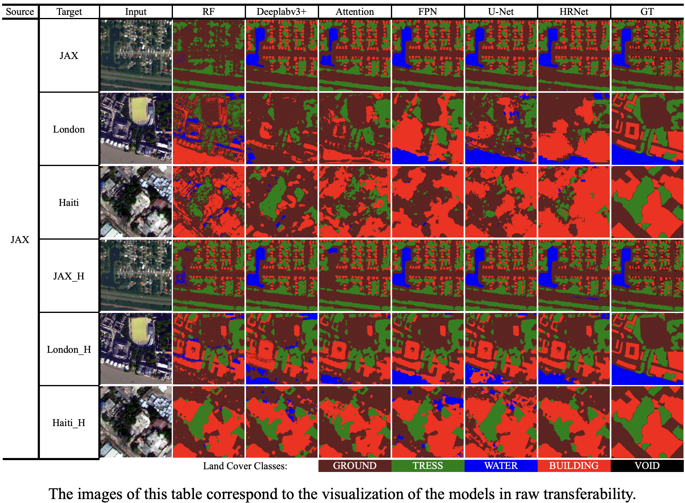
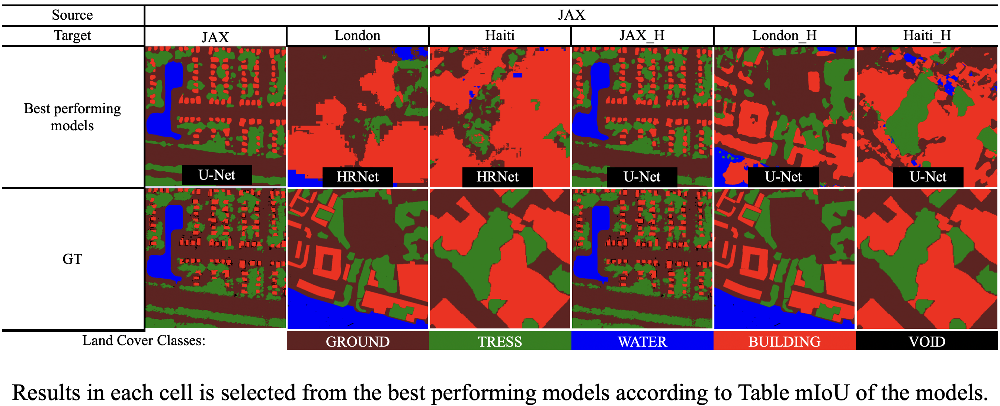
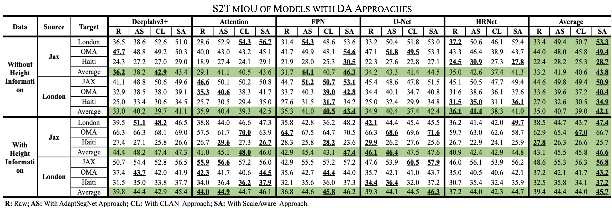
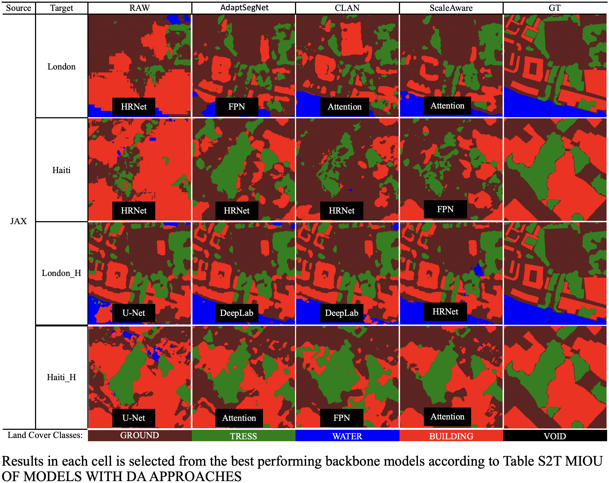

# On the Transferability of Learning Models for Semantic Segmentation for Remote Sensing Data

This repository hosts the official implementation of the paper "On the Transferability of Learning Models for Semantic Segmentation for Remote Sensing Data."

## Abstract
Recent deep learning-based methods outperform traditional learning methods on remote sensing (RS) semantic segmentation/classification tasks. However, they require large training datasets, and generally are known for lack of transferability, due to the highly disparate RS image content across different geographical regions. This paper aims to investigate the raw transferability of traditional and deep learning (DL) models, as well as the effectiveness of domain adaptation (DA) approaches in enhancing the transferability of the DL models (adapted transferability). The trained models and paper can be accessed through the links provided below:

- Trained Models: https://github.com/GDAOSU/Transferability-Remote-Sensing
- Paper: TBD

## Table of Contents
1. [Installation](#installation)
2. [Folder Structure](#folder-structure)
3. [Usage](#usage)
4. [Contributing](#contributing)
5. [License](#license)
6. [Supplementary data](#Supplementary-data)
7. [Acknowledgments](#acknowledgments)

## Installation

### Requirements
- Python 3.8
- PyTorch 1.13.0
- PyTorch-CUDA 11.7

### Setup
Setup the project environment using either pip or conda.

#### Using pip
```bash
pip install segmentation-models-pytorch
```

#### Using conda (mamba)
```bash
mamba install segmentation-models-pytorch
```

## Folder Structure
```
.
├── Base_model                # Base models for training and prediction
│   ├── Attention
│   ├── Deeplab
│   ├── FPN
│   ├── HRNet
│   └── UNet
├── DA_AdaptSegNet            # Domain adaptation method - AdaptSegNet
├── DA_CLAN                   # Domain adaptation method - CLAN
├── DA_ScaleAware             # Domain adaptation method - ScaleAware
├── Data                      # Data storage
├── Index-based               # Automation for evaluating base and DA models.
├── Posterior                 # Posterior probability calculations
├── RF                        # Random Forest model
├── Supplimentary             # Additional resources and figures
└── README.md                 # Project documentation
```


## Contributing

We welcome contributions to this project! Here's how you can contribute:

### Reporting Bugs or Issues

- If you encounter any bugs or issues, please [open an issue](https://github.com/GDAOSU/Transferability-Remote-Sensing/issues) explaining the problem and providing steps to reproduce the issue.
- Include any error messages, screenshots, or other relevant information in your issue report.

### Suggesting Enhancements

- If you have a suggestion for improving the project, whether it's a code enhancement, new feature, or documentation improvement, please [open an issue](https://github.com/GDAOSU/Transferability-Remote-Sensing/issues) describing your idea.

### Code Contributions

1. **Fork the Repository**:
   - Fork the [project repository](https://github.com/GDAOSU/Transferability-Remote-Sensing) to your GitHub account.

2. **Clone Your Fork Locally**:
   ```bash
   git clone https://github.com/your-username/Transferability-Remote-Sensing.git
   ```

3. **Create a New Branch**:
   ```bash
   git checkout -b new-feature-branch
   ```

4. **Make Your Changes**:
   - Implement your changes, ensuring that your code follows the project's coding standards.

5. **Test Your Changes**:
   - Ensure that your changes do not introduce any new bugs or issues.

6. **Commit Your Changes**:
   ```bash
   git commit -m "Description of your changes"
   ```

7. **Push Your Branch to GitHub**:
   ```bash
   git push origin new-feature-branch
   ```

8. **Open a Pull Request**:
   - Go to the [project repository](https://github.com/GDAOSU/Transferability-Remote-Sensing) on GitHub and open a new pull request against the main branch.

9. **Addressing Review Feedback**:
   - If your pull request receives feedback, make the necessary changes and push them to your branch.

We look forward to your contributions and thank you for helping improve the project!


## License
© 2022 The Ohio State University. All rights reserved. 

END-USER LICENSE AGREEMENT

IMPORTANT! READ CAREFULLY: This End-User License Agreement (“EULA”) is a legal agreement between you (either an individual or a single entity) (“You”) and The Ohio State University (“OSU”) for the use of certain “Works” that have been made in the course of research at OSU and any associated materials provided therewith (collectively, the “Works”).

1.	ACCEPTANCE OF THIS EULA.  YOU AGREE TO BE BOUND BY THE TERMS OF THIS EULA UPON THE EARLIER OF: (A) RECEIVING, REPRODUCING, OR OTHERWISE USING ANY OF THE WORKS OR (B) ACKNOWLEDGING THAT YOU HAVE READ THIS EULA AND CLICKING BELOW TO ACCEPT THE TERMS OF THE EULA.  IF YOU DO NOT AGREE TO THE TERMS OF THIS EULA, DO NOT COPY OR USE THE WORKS, AND DO NOT CLICK TO INDICATE ACCEPTANCE OF THIS EULA.

2.	License Grant.  Subject to the restrictions herein, OSU hereby grants to You a non-exclusive, worldwide license to use and reproduce the Works solely for Your internal, non-commercial purposes. OSU shall provide You copies of the Works in electronic, printable or reproducible form.

3.	Restrictions on Reproduction and Distribution.  You shall solely reproduce the Works for the limited purpose of generating sufficient copies for Your use internally and for non-commercial purposes, and shall in no event distribute copies of, transmit or display the Works to third parties by sale, rental, lease, lending, or any other means.  You shall not modify, translate, adapt, merge, or make derivative works of the Works.

4.	The Works are distributed "as-is." OSU expressly disclaims any warranties of any kind, either express or implied, including but not limited to implied warranties of merchantability, fitness for a particular purpose, or noninfringement.  OSU does not assume any responsibility or liability for damages of any kind that may result, directly or indirectly, from the use of the Works.  

## Supplementary data:







## Acknowledgments
We thank the organizers of the 2019 Data Fusion Contest and DigitalGlobe for providing the JAX and OMA datasets.